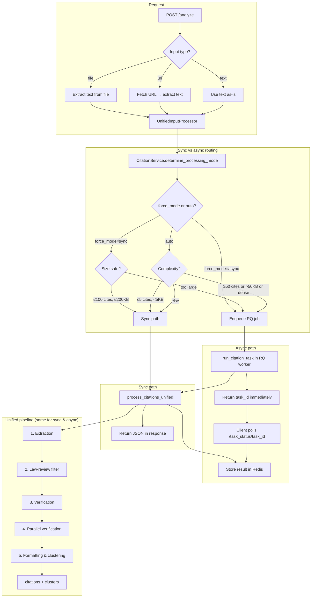
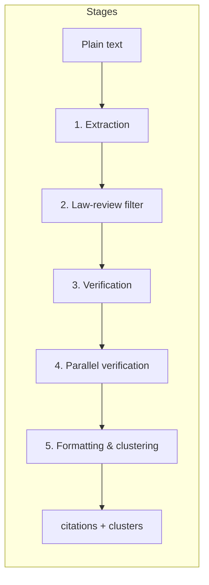

# Pipeline Entry Points

Single reference for how citation processing is invoked across the app. Use this when adding features or debugging request flow.

---

## Document processing flowchart

The following diagram shows how documents (file, URL, or pasted text) are processed from request to response.

**Clustering build id:** Pipeline metadata includes `clustering_version` (e.g. `2026-04-v8` from `CLUSTERING_VERSION` in `src/unified_clustering_master_optimized.py`) so API consumers and support can tell which merge/split rules produced a result.

**Routing (simplified):** Sync is used when the user requests `force_mode=sync` (and document is not too large: ≤100 estimated citations and ≤200KB text), or when automatic routing chooses sync (e.g. ≤5 citations and &lt;5KB text). Async is used for large or citation-heavy documents, or when `force_mode=async`. The same **unified pipeline** runs in both cases; only the execution context (in-process vs RQ worker) and response delivery (immediate vs poll `task_status`) differ.

---

## Async (background) path – file/URL uploads

| Step | Module | Symbol | Purpose |
|------|--------|--------|---------|
| 1 | API | `vue_api` `/analyze` (file/URL) | Enqueues job with RQ |
| 2 | RQ | `src.rq_worker.process_citation_task_direct` | Registered job target |
| 3 | `rq_worker` | `run_citation_task(...)` | Delegates to pipeline |
| 4 | `rq_worker_pipeline` | `run_citation_task` | Full task: get text → CitationService / DockerOptimizedProcessor → extraction, clustering, verification, post-splits, Redis result |

**Canonical async entry:** `src.rq_worker_pipeline.run_citation_task(task_id, input_type, input_data, logger=...)`

---

## Sync path – small docs / fallback

| Caller | Entry | Purpose |
|--------|--------|---------|
| `vue_api` `/analyze` (sync branch) | `UnifiedInputProcessor` → `process_citations_unified` | When “process immediately” is chosen |
| `unified_input_processor` (Redis fallback) | `process_citations_unified` | Sync fallback when Redis unavailable |
| `vue_api` file-upload sync (non-RQ path) | `process_citations_unified` | Direct file → text → pipeline |
| Health / smoke tests | `process_citations_unified` | Quick extraction test |
| `progress_manager` (citation count) | `process_citations_unified` | Quick count for progress steps |

**Canonical sync entry:** `src.unified_processing_pipeline.process_citations_unified(text, enable_verification=..., enable_parallel_verification=...)`. Run via `asyncio.run(...)` when calling from sync code.

---

## Internal pipeline stages (sync and async)

Once text is available, both sync and async paths run the same pipeline in `UnifiedProcessingPipeline.process_citations()`:

| Stage | What it does |
|-------|----------------|
| **1. Extraction** | `run_extract_citations` → UnifiedCitationProcessorV2 extracts citations, case names, and dates from text (eyecite + context). |
| **2. Law-review filter** | Remove law review / secondary source citations. |
| **3. Verification** | If enabled: verify citations against CourtListener (and fallbacks); set canonical_name, canonical_date, verified. |
| **4. Parallel verification** | Propagate canonical data from one citation to parallel citations in the same cluster. |
| **5. Formatting & clustering** | Build clusters (proximity + parallel links), annotate mismatch flags, apply date overrides, build final response with display fields. |

---

## Deprecated / compatibility

| Symbol | Location | Status |
|--------|----------|--------|
| `process_citation_task_direct` | `src.progress_manager` | **Deprecated.** Thin wrapper that logs and calls `run_citation_task`. Will be removed in a later release. Use `src.rq_worker.process_citation_task_direct` (RQ) or `run_citation_task` directly. |
| `extract_citations_production`, `extract_citations_with_clustering` | `src.citation_extraction_endpoint` | **Deprecated.** Raise immediately; no implementation. Use `process_citations_unified(...)` instead. All internal call sites have been migrated. |
| `UnifiedCitationProcessorV2.process_text` | `src.unified_citation_processor_v2` | **Deprecated as public entry.** Pipeline calls it internally; new code should use `process_citations_unified(...)` only. |

---

## Where results are stored

- **Async:** RQ job result + Redis keys (e.g. `task_result:{task_id}`, `progress:{task_id}`). Frontend polls `/task_status/<task_id>` and/or progress endpoints.
- **Sync:** Returned in the HTTP response from `/analyze`.

## Progress (single abstraction)

All sync, async, and polling paths report progress through the same manager (e.g. `get_progress_manager()`) and the same keys (`task_id`). URL fetching and text preprocessing live in `src/input_fetchers.py`; `progress_manager.py` is for progress tracking only (SSE, WebSocket, Redis, ProgressTracker).

---

## Troubleshooting: Sync vs async citation count

If the same PDF returns different citation (or cluster) counts for sync vs async (e.g. sync 35 citations / 103 clusters, async 177 citations / 101 clusters):

1. **Same text, same pipeline**  
   For file uploads on `/analyze`, both paths use the same flow: file → `UnifiedInputProcessor` → extract text (temp file + `extract_text_from_file_unified`) → `process_citations_unified`. Sync runs the pipeline in-process; async enqueues with `input_type="text"` and the same extracted text. So in theory counts should match.

2. **If counts differ, possible causes**  
   - **Different input text:** Sync uses a temp file from `request.files`; async (when enqueued from the same route) uses text extracted in the API. If the request body or temp file were truncated (e.g. client/nginx limits), sync could see less text.  
   - **Pipeline non-determinism:** Extraction/clustering can be order- or implementation-dependent; two runs on the same text might still differ.  
   - **Timeout:** Sync has a 180s cap; if it times out, the API returns partial/error and you may see fewer citations.

3. **How to compare**  
   Run `python scripts/test_sync_async_pdf.py <path_to.pdf>`. The script compares by citation key (citation text + offset) and cluster key (canonical_name + date). If it reports "same set of unique keys" but list lengths differ, that indicates duplicates or different serialization, not a different set of citations.

4. **Debugging**  
   Add logging in `unified_input_processor._process_citations_unified` (sync) and in `rq_worker_pipeline` (async) for `len(text)` and `len(pipeline_result.get("citations", []))` to confirm both paths receive the same text and to see pipeline output size before any response shaping.

### Small residual difference (acceptable)

A **small** gap (e.g. sync ~170 citations, async ~177; or “Only in async: 7” citations, “Only in sync: 2” clusters) is **expected and acceptable**:

- **Sync** responses go through `_format_response`, which applies a **court-year-only filter**: citations whose text is short (≤40 chars), contains a year, and does not start with a reporter pattern (e.g. `123 F.3d`) are removed. That avoids returning fragments like “N.J. 1997” as standalone citations.
- **Async** task_status returns the pipeline result **without** that filter (worker does not run `_format_response`). So async can have a few more citation entries (the ones that sync classifies as court-year-only).

To **verify** which citations sync removed, check backend logs for:

- `[FILTER] Removed N court-year-only items from citations (sync); remaining M`
- At DEBUG level, `[FILTER] court-year-only removed [k]: ...` for each removed citation (up to 10 samples).

**Clusters:** A small cluster difference (e.g. 2 clusters only in sync) can come from different clustering when the citation list differs slightly (e.g. those 7 citations affecting cluster boundaries). No change is required unless you need strict sync/async parity; in that case you could apply the same court-year-only filter in the worker before returning results.

**Sync request returns “processing” with 0 citations:** The backend may have `SYNC_REQUESTS_AS_ASYNC=true` (env or config). With that set, `force_mode=sync` is converted to async and the API returns a task_id immediately. Set `SYNC_REQUESTS_AS_ASYNC=false` to get true sync for the comparison script.

**How to list the exact citations/clusters that differ:** Run the comparison script with the same PDF you care about: `python scripts/test_sync_async_pdf.py <path_to.pdf>`. The script prints all "Only in sync" and "Only in async" citations (up to 20 each) and every differing cluster (canonical_name + date). The "async-only" citations are exactly the ones sync’s court-year-only filter removed; you can confirm in backend logs with `[FILTER] court-year-only removed [k]: ...` at DEBUG.

---

## Testing

- **Smoke test (canonical entry):** `pytest tests/test_pipeline.py -v` runs a smoke test that calls `process_citations_unified` with a short string and asserts citations/clusters shape.
- **Sync vs async comparison:** `python scripts/test_sync_async_pdf.py [path_to.pdf]` is the documented way to compare sync and async pipeline results (see Troubleshooting above).

---

## Updating this doc

When you add or remove an entry point, or change what the “canonical” sync/async path is, update this file and the table in `docs/CODE_STRUCTURE_IMPROVEMENTS.md` (§10).
